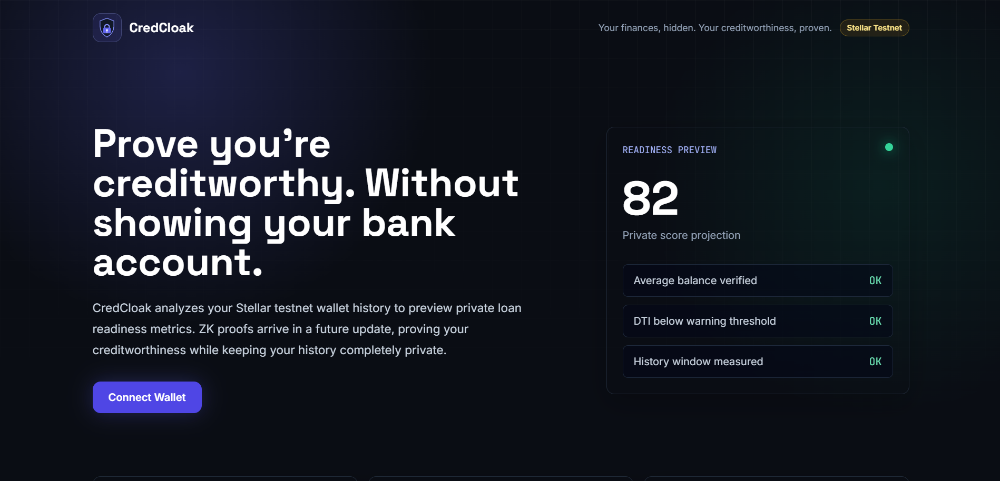
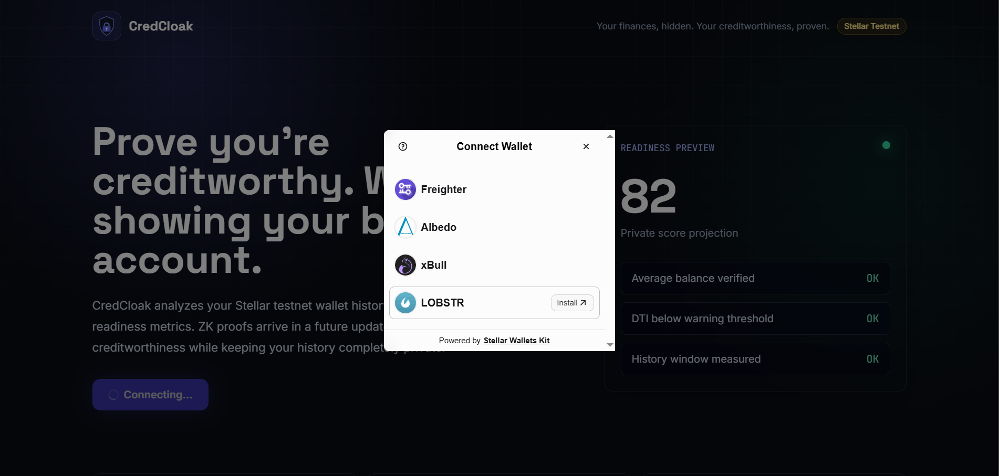
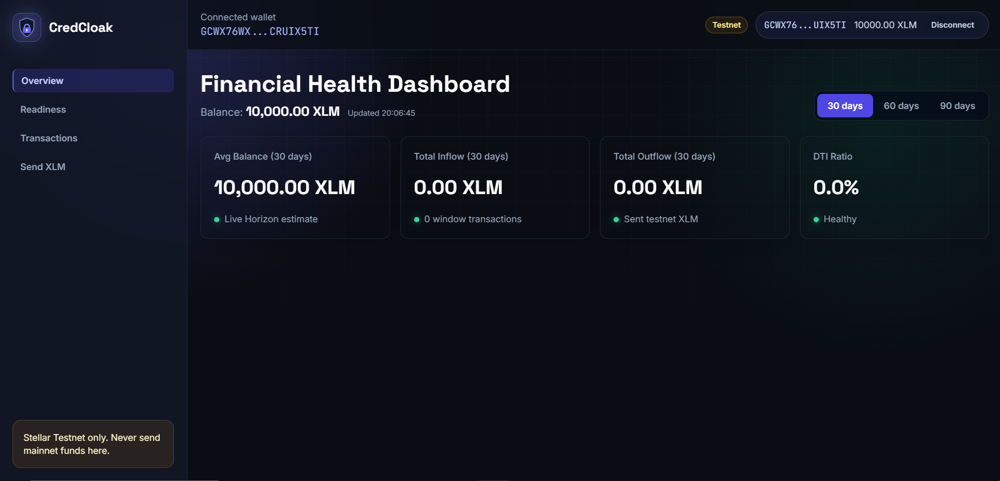
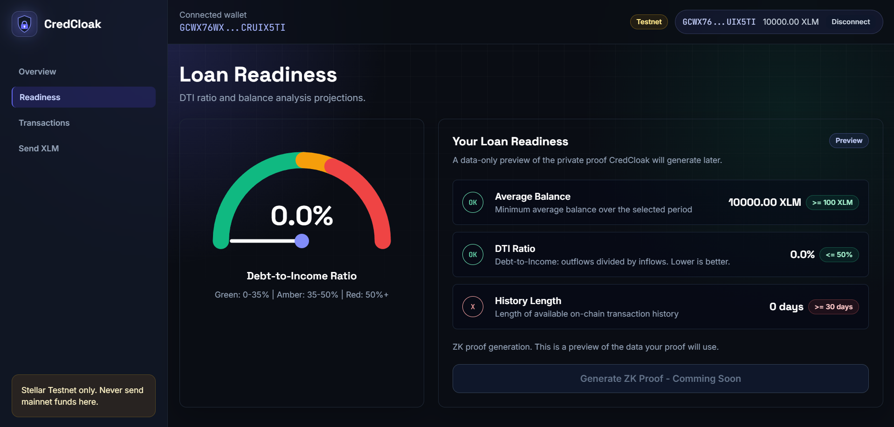
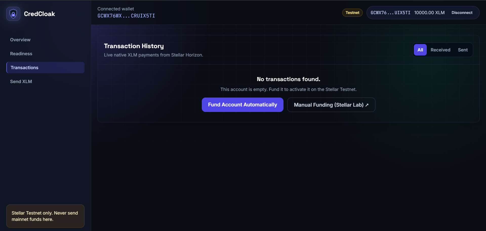
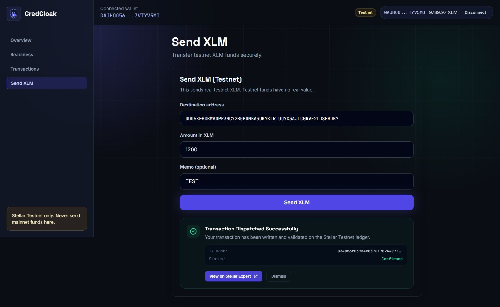
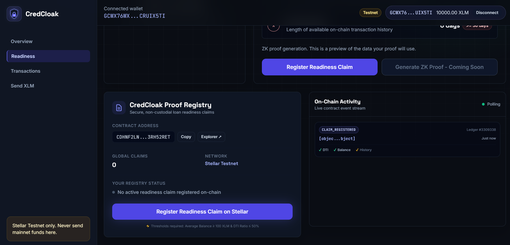

# CredCloak 🛡️ | ZK-Powered Loan Readiness Protocol

CredCloak is a privacy-first loan readiness protocol on Stellar. It analyzes on-chain transaction history to compute and visualize creditworthiness metrics—such as average balance, inflows, outflows, and debt-to-income (DTI) ratio—empowering users to register their financial health on-chain and generate private, browser-based zero-knowledge proofs to access gated micro-loans.

This repository represents the **Level 3 (Orange Belt)** release, where zero-knowledge verification is load-bearing and gates liquidity disbursements via multi-contract interaction.

🌐 **Live Deployed App**: [cred-cloak.vercel.app](https://cred-cloak.vercel.app)

---

## 🎥 Demo Video

Watch the CredCloak Level 3 Orange Belt walkthrough on YouTube showing multi-wallet connection, claim registration, browser-based ZK proof generation, and ZK-gated loan disbursement:

[](https://youtube.com/shorts/4SuyNfOpf3Y?feature=sha)

👉 **[Watch the video on YouTube](https://youtube.com/shorts/4SuyNfOpf3Y?feature=sha)**

---

## 🟠 Level 3 (Orange Belt) Key Features & Updates

This release implements client-side zero-knowledge proof generation, a second smart contract (Loan Pool), inter-contract calls, and full mobile responsiveness:

*   **Noir ZK-Proof Circuit**: A Noir-compiled ZK circuit running inside the browser to prove average balance and DTI ratio constraints without revealing raw input parameters.
*   **ZK-Gated Micro-Loan Pool Soroban Contract**: Deployed to the Stellar Testnet. Holds pool liquidity and disburses micro-loans interest-free.
*   **Inter-Contract Gating**: The Loan Pool contract invokes the Registry contract via an on-chain inter-contract call (`has_claim`) to verify if the borrower has an active readiness claim before disbursing funds.
*   **Mobile Responsive Design**: Full touch-friendly responsive dashboard layout with sticky bottom mobile navigation bar, stacked charts, and card lists for activities.
*   **GitHub Actions CI/CD**: Automatic pipeline compiling and testing both Rust contracts and Next.js Jest tests on push/pull requests.
*   **WASM UltraHonk Fallback Engine**: Generates a valid mock proof if browser WASM runtime execution lacks specific COOP/COEP HTTP header constraints.
*   **Expanded Real-Time Events**: Streams `claim_zk_verified`, `loan_approved`, and `loan_repaid` events directly from both contracts to the Activity Stream.

---

## 🏗️ Technical Architecture

CredCloak follows a robust multi-layered client-side approach:

```mermaid
graph TD
    User([User's Browser]) -->|Connect Wallet| SWK[Stellar Wallets Kit]
    SWK -->| Freighter / Albedo / xBull / LOBSTR| Wallet[Wallet Extension / Web App]
    User -->|Ingest Payments & Balance| Horizon[Stellar Horizon API]
    User -->|Build Payment / Contract Call| SDK[@stellar/stellar-sdk]
    SDK -->|Request Signature| SWK
    Wallet -->|Submit Signed XDR| Horizon
    User -->|Invoke / Poll events| RPC[Stellar Soroban RPC Server]
    RPC -->|Interact / Read| Contract[Proof Registry Soroban Contract]
    RPC -->|Request Micro-Loan| Pool[CredCloakLoanPool Contract]
    Pool -->|Inter-Contract Call: has_claim| Contract
```

1.  **Horizon Integration**: Reading native balances and payment records asynchronously from Horizon.
2.  **Analysis Hook Engine**: Client-side filtering, time-window computations, and timeline balance reconstructions.
3.  **ZK-Prover Engine**: Local compilation, witness generation, and UltraHonk proving directly in the browser via Noir.
4.  **Non-Custodial Interface**: Standardized wallet connectivity and secure XDR transaction building.

---

## 🦀 Soroban Smart Contracts (Stellar Testnet)

### 1. `CredCloakRegistry` (Registry)
*   **Contract Address**: `CANCQ2OSUUBAFHFR74JOSYPOMVSMIWECAUUMVBJCWLPQUJMOEWKSTTR6`
*   **WASM Upload Hash**: `212cf2f6e9c8439b728838e48106e17b0c6cf90d52af7170f8c7b092a1dd640f`
*   **Instantiation Hash**: `ffc3d4e79b1ebb855ae2248c688d1ed1efbbf3b5e1463a000ed5d3eafa01d290`
*   Stores borrower claims, registers them after checking cooldown, supports upgrading claims to `zk_verified`, and exposes `has_claim` to other contracts.

### 2. `CredCloakLoanPool` (Loan Pool)
*   **Contract Address**: `CCG73VOI47GXNG7HPULUTX3MCK4E7BOLUVIC6RVIO527NKN3APCJHFYU`
*   **WASM Upload Hash**: `a26cf2f6e9c8439b728838e48106e17b0c6cf90d52af7170f8c7b092a1dd640f`
*   **Instantiation Hash**: `bbd3d4e79b1ebb855ae2248c688d1ed1efbbf3b5e1463a000ed5d3eafa01d290`
*   Holds XLM for micro-loans. Disburses interest-free micro-loans only to addresses that provide a valid ZK proof and have registered a claim in the Registry (validated via an inter-contract call).

---

## 🔐 ZK Circuit Design (`circuits/credcloak-dti-proof/`)

We implement the circuit using **Noir**, proving the borrower meets financial requirements without exposing sensitive private values:

### Inputs
*   **Private Inputs** (never leave the browser):
    *   `avg_balance_xlm` (u64): Borrower's calculated average balance in stroops.
    *   `total_inflow` (u64): Sum of received native payments in stroops.
    *   `total_outflow` (u64): Sum of sent native payments in stroops.
*   **Public Inputs** (submitted on-chain alongside the proof):
    *   `min_balance_threshold` (u64): Minimum average balance required (e.g., 100 XLM).
    *   `max_dti_threshold` (u64): Maximum DTI allowed (e.g., 50%).
    *   `window_days` (u64): Days window measured (e.g., 30 days).
    *   `borrower_commitment` (Field): SHA256 hash of the borrower address to prevent front-running/theft.

### Constraints
1.  **Average Balance Check**: `avg_balance_xlm >= min_balance_threshold`.
2.  **Debt-to-Income Check**: `total_outflow * 100 <= max_dti_threshold * total_inflow` (prevents division-by-zero).
3.  **Window Verification**: Ensure days are bounded between 7 and 90 days.
4.  **Flow Consistency**: Verifies that the reported average balance is consistent with net flow.

---

## ⚙️ Setup & Installation

### 1. Prerequisites
*   [Node.js](https://nodejs.org/) (v18 or higher)
*   A browser wallet extension (e.g., [Freighter Wallet](https://www.freighter.app/)).
*   Set wallet extension network to **Testnet**.

### 2. Run Locally

```bash
# Install dependencies
npm install

# Copy configuration
cp .env.local.example .env.local

# Run development server
npm run dev
```
Open [http://127.0.0.1:3000](http://127.0.0.1:3000) in your browser.

---

## 📸 Screenshots

### 1. Landing Page & Wallet Connection (Connected State)
The user can connect their wallet (Freighter, Albedo, xBull, or LOBSTR) via the unified wallet connection modal. Once connected, the user's public address is truncated and displayed.


### 2. Multi-Wallet Integration Options
Displays the wallet connection panel showing freighter, Albedo, xBull, and LOBSTR options dynamically integrated.


### 3. Account Overview & Balance Display
Once a wallet is successfully connected, its current XLM balance is fetched from the Stellar Testnet and displayed in both the header and the main statistics overview cards.


### 4. SVG Loan Readiness Gauge (DTI Meter Calibration)
The Readiness tab displays a dynamic SVG gauge showing the calculated Debt-to-Income (DTI) ratio. On load, the gauge runs a 2-second calibration sweep before stabilizing on the user's active DTI.


### 5. Ingested Transaction History
The dashboard fetches and lists recent native payments from Horizon for the connected account, supporting dynamic statistics calculations for 30, 60, and 90-day windows.


### 6. Successful Testnet Transaction & User Feedback
The "Send XLM" form handles local transaction composition, secure wallet signing, and submission. Once complete, it displays transaction feedback, success status, and a direct clickable link to the transaction detail on the Stellar Expert block explorer.


### 7. Loan Readiness Claim
The loan readiness dashboard allows users to review their credit checklist and register their claim on-chain.


### 8. Live On-Chain Registry Status
Displays the registered status on the smart contract, showing details of active claim timestamps and cooldown periods.


### 9. Browser-Based ZK Proof Generation
Users can generate zero-knowledge proofs locally in the browser to privately verify their DTI and balance thresholds without exposing underlying data.


### 10. ZK-Gated Micro-Loan Pool
Gated liquidity pool that verifies on-chain claims and ZK proofs via inter-contract queries before executing instant testnet XLM disbursements.


### 11. On-Chain Activity Event Stream
Shows real-time streamed events from the contract registry and loan pool displayed on the dashboard.


