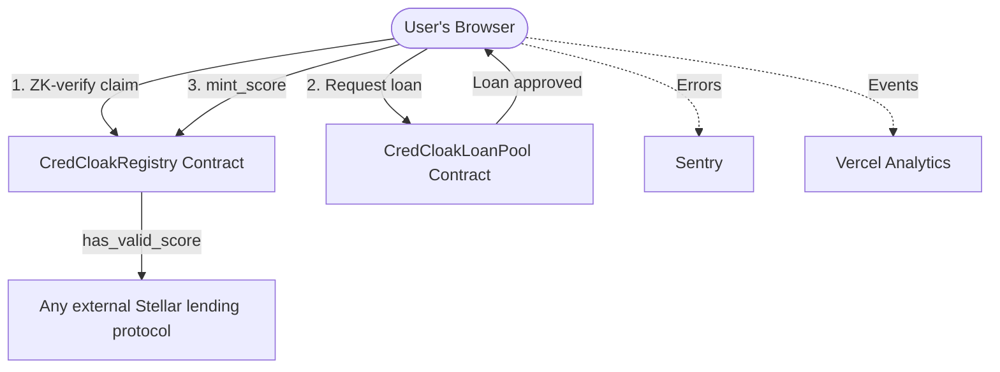

# 🟢 CredCloak — Level 4 (Green Belt) Documentation
## CredCloak Score, Real-User Onboarding & Production Readiness

This document outlines the design, implementation, and integration of the soulbound CredCloak Score, guided onboarding, monitoring/analytics, and reliability work shipped in the Green Belt (Level 4) release.

---

## 🎯 Architectural Overview

Level 4 shifts the goal from "does it work" to "would a real person use it, and do we know if it breaks." Three additions sit on top of the Level 3 stack:
1. **CredCloak Score** — a non-transferable, on-chain credit signal minted on the Registry contract, readable by any external Stellar protocol.
2. **Guided onboarding** — a 5-step wizard that walks a first-time user from wallet connect through their first micro-loan.
3. **Observability** — Sentry error monitoring, Vercel Analytics event tracking, toast notifications, retry logic, and skeleton loading states.



---

## 🛡️ CredCloak Score (`contracts/credcloak-registry/src/lib.rs`)

A soulbound credit signal minted once a claim is ZK-verified, valid for 30 days from the proof timestamp.

### New Contract Methods
* `mint_score(env, borrower, proof_timestamp) -> Result<(), ContractError>` — requires `borrower.require_auth()` and that the claim is already `zk_verified`; sets `score_minted = true` and `score_expiry = proof_timestamp + 30 days`; emits a `score.minted` event.
* `has_valid_score(env, borrower) -> bool` — read-only, no auth required, so **any external protocol** can gate on CredCloak's readiness signal without re-running the ZK proof.

### New `ReadinessClaim` Fields
```rust
pub score_minted: bool,
pub score_expiry: u64, // 0 if never minted
```

### Error Handling
* `ContractError::NotZkVerified` — returned by `mint_score` if the caller's claim has not yet passed ZK verification.

---

## 🖥️ Frontend Integration

### `components/CredCloakScore.tsx`
Displays ACTIVE/EXPIRED score state, the ZK/balance/DTI check summary, mint and expiry dates, and a "View on Stellar Expert" link. Shown on the dashboard once a claim is ZK-verified; offers a "Mint CredCloak Score" or "Refresh Score" action depending on state.

### `app/onboarding/` — Guided 5-Step Wizard
Reuses existing hooks (`useWallet`, `useFinancialStats`, `useZKProof`) and contract wrappers (`registerReadinessClaim`, `upgradeClaimToZKVerified`, `requestLoan`) rather than reimplementing flow logic:
1. Connect Wallet
2. Fund Account (Friendbot)
3. Register Claim
4. Generate ZK Proof
5. Request Micro-Loan

### `components/FeedbackWidget.tsx` + `app/api/feedback/route.ts`
A 3-question feedback form (star rating, recommend radio, optional comments) shown after a successful loan request. Submissions are appended to `docs/feedback-submissions.json` via a serverless API route.

---

## 📈 Observability

### Analytics (`lib/analytics.ts`)
Thin wrapper around `@vercel/analytics`'s `track()`. Instrumented events: `wallet_connected`, `claim_registered`, `proof_generation_started/completed/failed`, `loan_requested/approved/repaid`, `credcloak_score_minted`, `feedback_submitted`.

### Error Monitoring (Sentry)
* `sentry.client.config.ts` / `sentry.server.config.ts` / `sentry.edge.config.ts` initialize Sentry with a 10% trace sample rate, filtering out expected "user declined wallet signature" noise.
* `components/ErrorBoundary.tsx` wraps the app and reports render-time crashes via `Sentry.captureException`.
* `next.config.js` wraps the Next.js config with `withSentryConfig`.

### Reliability
* `lib/retry.ts` — exponential backoff retry helper (`withRetry`), applied to Horizon API calls in `lib/horizon.ts` (`fetchAccountDetails`, `fetchTransactions`).
* `components/ui/Skeleton.tsx` — pulse-animated loading placeholders replacing spinner-only loading states in `TransactionHistory.tsx` and `LoanPoolPanel.tsx`.
* All `alert()` calls replaced with `react-hot-toast` toast notifications (`components/ToastProvider.tsx`), mounted globally in `app/providers.tsx`.

---

## ⚙️ Environment Variables (`.env.local`)

New variables added on top of the Level 3 set (leave blank to disable monitoring):
```bash
NEXT_PUBLIC_SENTRY_DSN=
SENTRY_ORG=
SENTRY_PROJECT=
```

---

## 🧪 Real-User Validation

Level 4 requires validating the full flow with 10 real testnet users. See [`docs/USER_FEEDBACK.md`](./USER_FEEDBACK.md) for the tracking table (wallet addresses, transaction hashes, and feedback ratings).

---

## 📸 Application Snapshots

_Placeholder — add Level 4 snapshots (CredCloak Score card, onboarding wizard, feedback widget, Sentry/analytics dashboards) to `snapshots/` and reference them here before submission._
