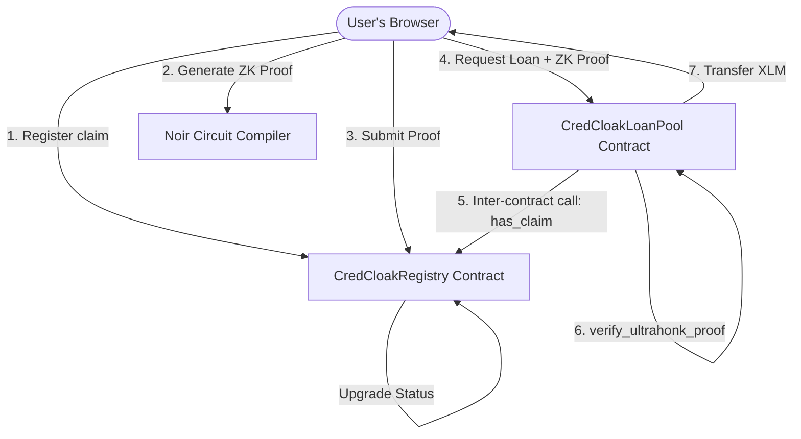

# 🟠 CredCloak — Level 3 (Orange Belt) Documentation
## Zero-Knowledge Proving (Noir) & Inter-Contract Registry Gating

This document outlines the design, implementation, and integration of client-side ZK-proofing and multi-contract gating for the Orange Belt (Level 3) release.

---

## 🎯 Architectural Overview

Level 3 makes the zero-knowledge verification **load-bearing**. Borrowing micro-loans from the `CredCloakLoanPool` is gated by two checks:
1. **On-Chain Claim Registry Gating** (via an inter-contract call to the `CredCloakRegistry` contract).
2. **ZK Proof Gating** (via verifying an UltraHonk ZK Proof of creditworthiness directly inside the transaction).



---

## 🔐 ZK Circuit Design (`circuits/credcloak-dti-proof/`)

We implement the circuit using **Noir**, proving the borrower meets financial requirements without exposing sensitive private values:

### Inputs
*   **Private Inputs** (never leave the browser):
    *   `avg_balance_xlm` (u64): Borrower's calculated average balance.
    *   `total_inflow` (u64): Sum of received native payments.
    *   `total_outflow` (u64): Sum of sent native payments.
*   **Public Inputs** (submitted on-chain alongside the proof):
    *   `min_balance_threshold` (u64): Minimum average balance required (e.g. 100 XLM).
    *   `max_dti_threshold` (u64): Maximum DTI allowed (e.g. 50%).
    *   `window_days` (u64): Days window measured (e.g. 30 days).
    *   `borrower_commitment` (Field): SHA256/Poseidon hash of the borrower address to prevent front-running/theft.

### Constraints
1.  **Average Balance Check**: `avg_balance_xlm >= min_balance_threshold`.
2.  **Debt-to-Income Check**: `total_outflow * 100 <= max_dti_threshold * total_inflow` (prevents division-by-zero).
3.  **Window Verification**: Ensure days are bounded between 7 and 90 days.
4.  **Flow Consistency**: Verifies that the reported average balance is consistent with net flow.

---

## 🦀 Smart Contracts

### 1. `CredCloakRegistry` (Updated)
*   **WASM Target**: `target/wasm32-unknown-unknown/release/credcloak_registry.wasm`
*   **New Methods**:
    *   `upgrade_to_zk_verified`: Marks a claim as verified after ZK proof hash submission.
    *   `has_claim`: Wrapper for check active status from other contracts.

### 2. `CredCloakLoanPool` (New)
*   **WASM Target**: `target/wasm32-unknown-unknown/release/credcloak_loan_pool.wasm`
*   **Methods**:
    *   `initialize`: Links the pool with the Registry and token address.
    *   `request_loan`: Validates proof, checks Registry status (inter-contract), and transfers funds.
    *   `repay_loan`: Accept loan repayments.
    *   `deposit`: Pool funding.
    *   `get_pool_balance` / `get_loan`: Read helper states.

---

## 📡 Live Event Stream Updates

The dashboard streams new event types from both contracts:
*   `claim_zk_verified`: Emitted on successful ZK claim upgrades.
*   `loan_approved`: Emitted when a micro-loan is approved and disbursed.
*   `loan_repaid`: Emitted on loan repayment completion.

---

## ⚙️ Environment Variables (`.env.local`)

Ensure the following variables are configured in your `.env.local` to connect to the deployed testnet contracts:
```bash
NEXT_PUBLIC_STELLAR_NETWORK=testnet
NEXT_PUBLIC_HORIZON_URL=https://horizon-testnet.stellar.org
NEXT_PUBLIC_NETWORK_PASSPHRASE=Test SDF Network ; September 2015
NEXT_PUBLIC_STELLAR_LAB_URL=https://stellar.expert/explorer/testnet
NEXT_PUBLIC_CONTRACT_ADDRESS=CANCQ2OSUUBAFHFR74JOSYPOMVSMIWECAUUMVBJCWLPQUJMOEWKSTTR6
NEXT_PUBLIC_LOAN_POOL_ADDRESS=CCG73VOI47GXNG7HPULUTX3MCK4E7BOLUVIC6RVIO527NKN3APCJHFYU
NEXT_PUBLIC_SOROBAN_RPC_URL=https://soroban-testnet.stellar.org
```

---

## 📸 Application Snapshots

The following screenshots capture the new features and integrations added in Level 3 (Orange Belt):

### 1. Loan Readiness Claim
The loan readiness dashboard allows users to review their credit checklist and register their claim on-chain.


### 2. Browser-Based ZK Proof Generation
Users can generate zero-knowledge proofs locally in the browser to privately verify their DTI and balance thresholds without exposing underlying data.


### 3. ZK-Gated Micro-Loan Pool
Gated liquidity pool that verifies on-chain claims and ZK proofs via inter-contract queries before executing instant testnet XLM disbursements.

